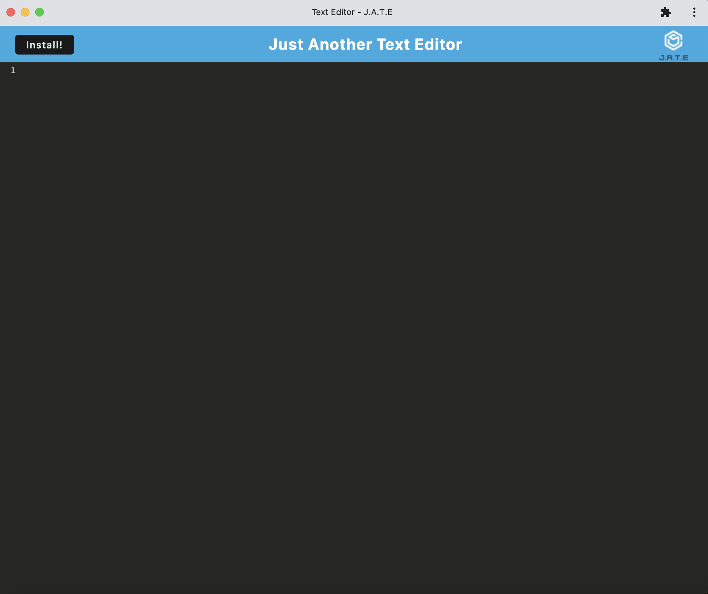

# Just Another Text Editor
  
  ## Description
  This program is a PWA program that uses Indexeddb to store data. The app can run offline and is a representation of the abilities associated with PWAs.

  ## Table of Contents
   * [Link](#link)
   * [Image](#image)
   * [Installation](#installation)
   * [Usage](#usage)
   * [License](#license)
   * [Contributing](#contributing)
   * [Tests](#tests)
   * [Questions](#questions)
  
  ## Link
  [Deployed App](https://powerful-forest-60668.herokuapp.com/)
  ## Image
  
  ## Installation
  To install necessary dependencies run the following command:

    npm start (from root, scripts will then install dependencies)

  ## Usage
  This repo uses indexeddb, webpack, express, concurrently, and many webpack plugins 

  ## License
  This project os licensed under the MIT license.
    

  ## Contributing
  If you would like to contribute, please fork the repo and pull request.

  ## Tests
    No tests to be ran

  ## Questions
  If you have any questions about the repo, contact me at [MatValdejao](https://github.com/MatValdejao) or by email: [matvaldejao123@gmail.com](mailto:matvaldejao123@gmail.com)
